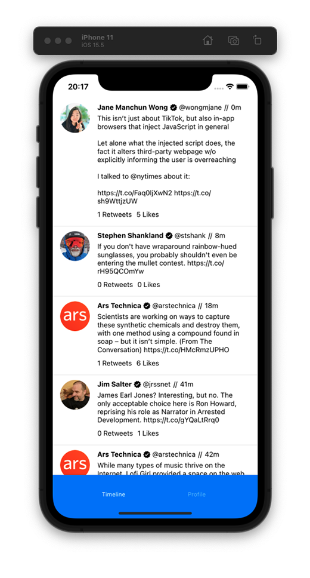
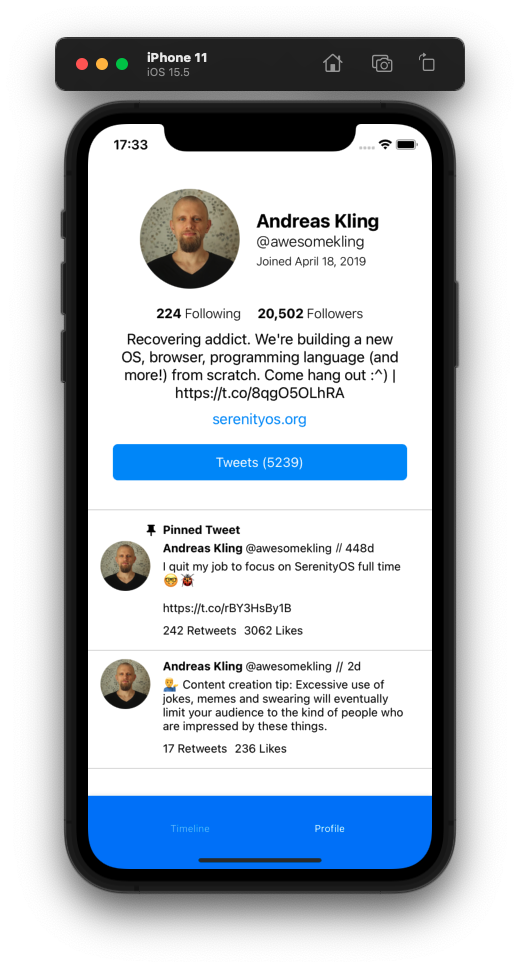
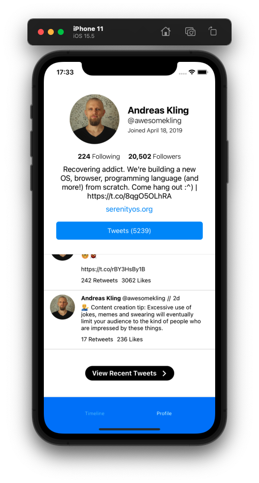
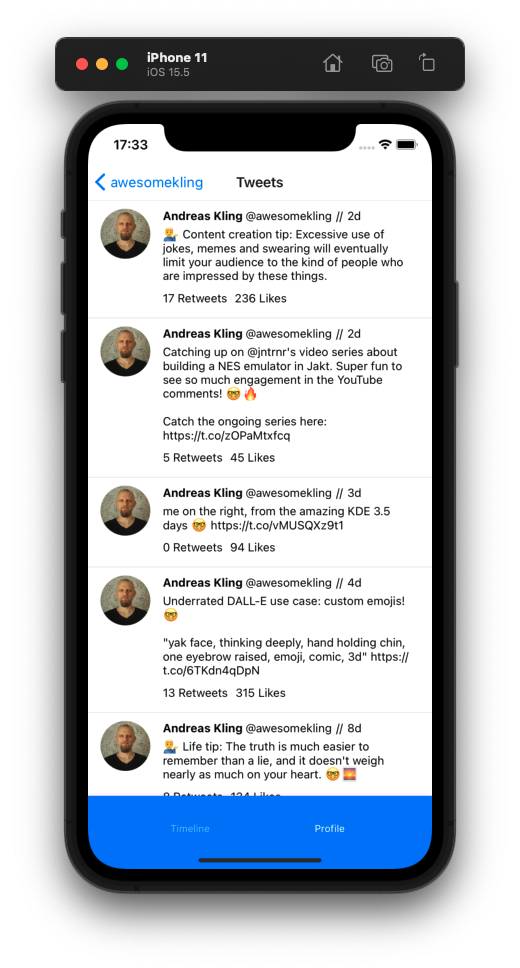

# 🐦 antibirdapp

The goal of this project is to make a Twitter client with React Native. This client will intentionally add friction to the Twitter experience. For example, we only fetch ten of a given user's most recent tweets in the timeline. This dramatically limits how many tweets are populated on the timeline, and so the user is less likely to doomscroll.

## Usage

As this app is still in development, a number of features have yet to be implemented like the user being able to set their own username.

If you would like to run this app yourself, please follow these steps:

1. Ensure Node and Expo are installed.
2. Clone the project.
3. Change 'username' instead `App.jsx` to your desired username.
4. Run `npm i` to install the project's dependencies.
5. Populate TWITTER_BEARER_TOKEN inside .env to the bearer token of your Twitter API app.
6. Run either `npm run android` or `npm run ios`.

## Screenshots

# TODO

- Complete Profile View ✅
- Complete Tweets View ✅
- Complete Timeline
- Add search bar to set the username
